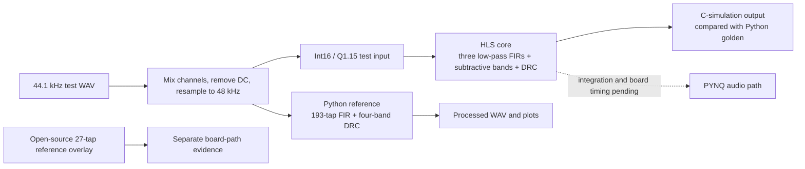

# PYNQ-Z2 Multiband Audio Processing Accelerator

## Design report draft

**Status as of 2026-10-01:** the Python reference path and the custom HLS core are present. The custom core has out-of-context synthesis and implementation records. The custom core has not yet been integrated into the board audio path or measured end to end. This report separates measured results from planned work so that the reference-overlay demonstration is not mistaken for a demonstration of the custom core.

## 1. Project goal

The project explores a multiband dynamic-range-compression (DRC) audio pipeline on a PYNQ-Z2 board. DRC reduces the level of signals above a threshold. The algorithm divides audio into frequency bands, applies the same compression rule to each band, and sums the results.

The planned comparison uses a Python reference, an HLS implementation, and an RTL implementation. At this snapshot the repository contains the Python reference and HLS source. No custom RTL source or three-way comparison is present.

## 2. Current algorithm

The current design uses a subtractive crossover. It designs three linear-phase low-pass filters at 500 Hz, 1,000 Hz, and 2,000 Hz, each with 193 taps. The bands are formed as follows:

```text
band 1 = LP500
band 2 = LP1000 - LP500
band 3 = LP2000 - LP1000
band 4 = delayed input - LP2000
```

The four bands sum to the input delayed by the FIR group delay before compression. At 193 taps, the group delay is 96 samples, or 2.00 ms at 48 kHz. The DRC uses a threshold of 0.1 and a slope of 0.7. The Python reference uses floating-point arithmetic; the HLS core uses a fixed-point input/output path. Quantization error must therefore be measured separately from algorithm alignment.

The single parameter source for sample rate, edges, and DRC defaults is `src/python/band_design.py`. HLS coefficients are generated into `sim/hls_csim/` by `src/python/export_coefficients.py`.



The diagram separates the project's custom HLS core from the open-source reference overlay. The dotted connection is planned work, not a completed integration.

## 3. Python reference implementation

`src/python/multiband_baseline.py` reads `data/audio/real_voice.wav`, mixes its stereo channels, removes the DC component, and resamples from the file's 44.1 kHz rate to the design rate of 48 kHz. It processes the signal with four subtractive bands and saves a WAV file and spectrum plot.

The current local run used Python 3.9.12, NumPy 2.0.2, SciPy 1.13.1, Matplotlib 3.9.4, and SoundFile 0.13.1. The latest best-of-five processing run took 89.5 ms for 10.58 s of audio, or 0.176 µs per sample and 118.3× host real time. The host CPU model was unavailable, so this is a local reference measurement, not a portable benchmark.

The Python runtime number is faster per sample than the HLS schedule number below. The measurements use different platforms and scopes; they do not establish an FPGA speedup. The HLS core may still be useful for freeing processor time or providing predictable hardware execution, but this repository does not yet quantify those system-level benefits.

The current run reported a maximum coefficient-sum reconstruction error of `3.469e-18` before DRC. Its output artifacts are `data/audio/multiband_output.wav` and `data/figures/multiband_comparison.png`. The independent 1,000-sample test vector used by the HLS testbench is in `data/audio/test_input.txt`; the corresponding Python golden output is `data/results/python_golden.txt`.

## 4. HLS core results

`src/hls/fir_multiband.cpp` contains the subtractive FIR and DRC implementation. `src/hls/fir_tb.cpp` supplies the C-simulation testbench. The current implementation report records the 193-tap, fixed-point, multiplier-unlimited design point:

| Metric | Recorded value |
| --- | ---: |
| LUT | 3,962 (7.5%) |
| Flip-flops | 5,514 (5.2%) |
| DSP | 202 (91.8%) |
| BRAM | 51.5 (36.8%) |
| Worst negative slack at a 10 ns constraint | +1.624 ns |
| HLS schedule | 449 cycles/sample |

At 100 MHz, 449 cycles correspond to 4.49 µs per sample, compared with the 20.83 µs sample period at 48 kHz. The resource and timing figures come from an out-of-context core implementation. They exclude the surrounding AXI, audio, and overlay logic. The scheduled cycles are an HLS schedule result, not a board measurement. The integrated design must be measured again after the technical lead completes the overlay.

The implementation history and measurement limitations are documented in `data/results/impl_metrics.md`. Do not compare the out-of-context rows with rows measured using a different flow without accounting for the methodology change.

## 5. Board evidence

The repository records a successful PYNQ-Z2 test of an open-source 27-tap reference overlay in `data/results/reference_overlay_metrics.md`. That test validates the reference overlay's DMA and board control flow. It does not execute the project's custom HLS core and must not be presented as the project's end-to-end accelerator result.

The repository also contains `board/overlay/ps_only.bit`, board notebooks, and playback/verification scripts. The bitstream is labelled `ps_only`; the repository does not establish that it contains the custom multiband HLS core. A custom-core live audio demonstration and its end-to-end latency remain open tasks.

## 6. Validation status

| Check | Status at this snapshot |
| --- | --- |
| Python subtractive-band reconstruction identity | Regenerated locally; maximum error `3.469e-18` |
| Python audio output and spectrum | Regenerated locally on 2026-10-01 |
| Python time-frequency waterfall | Generated locally on 2026-10-01 |
| Python golden output for the current 1,000-sample test vector | Regenerated locally on 2026-10-01 |
| Stored HLS output compared with the regenerated golden file | Passed on 2026-10-01: 75.4 dB SNR, best lag 0; the stored transparent output matched bit for bit at 96 samples |
| Rebuilding the HLS C simulation in this workstation | Pending; Vitis HLS is unavailable at the documented installation path |
| Custom HLS core out-of-context implementation | Results recorded in `data/results/impl_metrics.md` |
| Custom HLS core integrated into the audio overlay | Pending |
| Custom-core board audio and end-to-end latency | Pending |
| RTL implementation and Python/HLS/RTL comparison | Pending |

The current stored HLS output passes comparison against the newly generated 193-tap Python golden file, and the stored transparent output confirms the expected 96-sample delay. Rebuilding the C-simulation output with the final toolchain remains necessary for reproducibility; filenames alone do not establish which source flags produced a result.

## 7. Reproduction

From the repository root, create a Python environment and run:

```powershell
py -3 -m venv .venv
.\.venv\Scripts\Activate.ps1
python -m pip install -r requirements-python.txt
python src/python/multiband_baseline.py --taps 193 --repeat 5
python src/python/export_coefficients.py --taps 193
python src/python/export_golden.py --taps 193
```

The HLS C-simulation flow is documented in `build/hls/run_csim.tcl` and the README. It requires the matching Vitis HLS installation. Before publishing the comparison, record the tool version, exact build flags, test input, output filenames, sample alignment, SNR, and transparent-mode bit-exact check.

## 8. Remaining work before submission

1. Confirm the target PYNQ image and Vivado/Vitis version with the technical lead. The repository contains reference evidence for PYNQ 2.7 and Vivado/Vitis HLS 2020.2, while the team plan specifies PYNQ 3.1 and Vivado 2024.1.
2. Rerun the 193-tap C simulation and compare it with the regenerated Python golden data.
3. Integrate the custom core into the board overlay, then capture live audio and end-to-end latency/throughput measurements.
4. Produce the same-input Python/HLS/RTL comparison after an RTL implementation exists.
5. Replace the provisional video script claims with recorded evidence, review the English poster, and run a clean-machine reproduction.

## 9. Project artifacts

- Python reference: `src/python/multiband_baseline.py`
- Spectrum waterfall utility: `src/python/plot_spectrum_waterfall.py`
- Shared filter design: `src/python/band_design.py`
- HLS core and testbench: `src/hls/fir_multiband.cpp`, `src/hls/fir_tb.cpp`
- Current Python metrics: `data/results/baseline_metrics.md`
- HLS implementation metrics: `data/results/impl_metrics.md`
- Reference-overlay metrics: `data/results/reference_overlay_metrics.md`
- Collaboration record: `report/llm_collab_log/`
- Skill package: `skill/`
