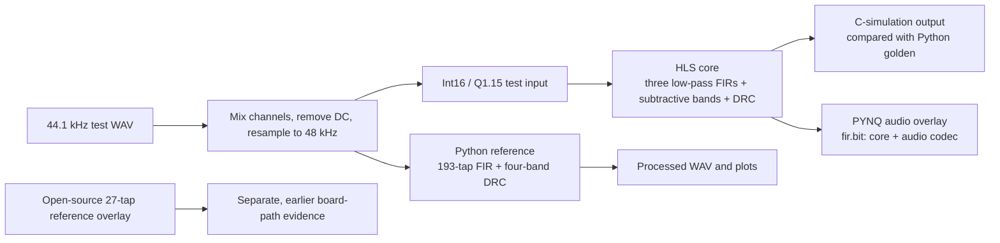

# PYNQ-Z2 Multiband Audio Processing Accelerator

## Design report draft

**Status as of 2026-10-01:** the Python reference path and the custom HLS core are present. The core is integrated into a board overlay together with the PYNQ audio codec (`board/overlay/fir.bit`), has processed real captured audio on the board, and has been measured on the same chip against the Zynq ARM running the identical algorithm. Out-of-context and integrated-in-overlay figures are reported separately and labelled; the reference-overlay measurements are a different experiment and are kept apart from the custom core.

## 1. Project goal

The project explores a multiband dynamic-range-compression (DRC) audio pipeline on a PYNQ-Z2 board. DRC reduces the level of signals above a threshold. The algorithm divides audio into frequency bands, applies the same compression rule to each band, and sums the results.

The planned comparison uses a Python reference, an HLS implementation, and an RTL implementation. At this snapshot the repository contains the Python reference and HLS source. No custom RTL source or three-way comparison is present.

## 2. Current algorithm

The current design uses a subtractive crossover. It designs three linear-phase low-pass filters at 500 Hz, 1,000 Hz, and 2,000 Hz, each with 193 taps. The bands are formed as follows:

```text
band 1 = LP500
band 2 = LP1000 - LP500
band 3 = LP2000 - LP1000
band 4 = delayed input - LP2000
```

The four bands sum to the input delayed by the FIR group delay before compression. At 193 taps, the group delay is 96 samples, or 2.00 ms at 48 kHz. The DRC uses a threshold of 0.1 and a slope of 0.7. The Python reference uses floating-point arithmetic; the HLS core uses a fixed-point input/output path. Quantization error must therefore be measured separately from algorithm alignment.

The single parameter source for sample rate, edges, and DRC defaults is `src/python/band_design.py`. HLS coefficients are generated into `sim/hls_csim/` by `src/python/export_coefficients.py`.



The diagram separates the project's custom HLS core from the open-source reference overlay. The custom core is integrated and has run on the board; the reference overlay is an unrelated earlier experiment.

## 3. Python reference implementation

`src/python/multiband_baseline.py` reads `data/audio/real_voice.wav`, mixes its stereo channels, removes the DC component, and resamples from the file's 44.1 kHz rate to the design rate of 48 kHz. It processes the signal with four subtractive bands and saves a WAV file and spectrum plot.

The current local run used Python 3.9.12, NumPy 2.0.2, SciPy 1.13.1, Matplotlib 3.9.4, and SoundFile 0.13.1. The latest best-of-five processing run took 89.5 ms for 10.58 s of audio, or 0.176 µs per sample and 118.3× host real time. The host CPU model was unavailable, so this is a local reference measurement, not a portable benchmark, and it must not be divided by the board-side figures — a 3 GHz desktop x86 and a 100 MHz FPGA differ by orders of magnitude by construction.

The comparison that carries the speedup claim is measured on the board itself, on the same chip, with the same algorithm on both sides: the Zynq ARM in software against the PL core. That measurement gives 6.116 µs against 4.507 µs per sample, a 1.4× ratio. `data/results/accel_cpu_vs_fpga.md` records the conditions and caveats that must travel with the number: CPU float64 versus core Q1.15, scipy's optimized C implementation (but no hand-written NEON comparison), and the core's symmetry optimization, which halves its multiplication count relative to this CPU run. The PL time includes software register/cache handling; at this block size it was measured to be negligible relative to the 4.500 µs schedule.

The current run reported a maximum coefficient-sum reconstruction error of `3.469e-18` before DRC. Its output artifacts are `data/audio/multiband_output.wav` and `data/figures/multiband_comparison.png`. The independent 1,000-sample test vector used by the HLS testbench is in `data/audio/test_input.txt`; the corresponding Python golden output is `data/results/python_golden.txt`.

## 4. HLS core results

`src/hls/fir_multiband.cpp` contains the subtractive FIR and DRC implementation. `src/hls/fir_tb.cpp` supplies the C-simulation testbench. Two implementations of the same 193-tap, fixed-point source are recorded, and their numbers must not be mixed:

| Metric | Core alone (out of context) | Core inside the board overlay |
| --- | ---: | ---: |
| LUT | 3,962 (7.5%) | 6,422 (12.07%) |
| Flip-flops | 5,514 (5.2%) | 9,416 (8.85%) |
| DSP | 202 (91.8%) | 202 (91.82%) |
| BRAM | 51.5 (36.8%) | 54.5 (38.9%) |
| Worst negative slack at a 10 ns constraint | +1.624 ns | +0.256 ns |
| Failing endpoints | 0 | 0 |
| HLS schedule | 449 cycles/sample | 450 cycles/sample |

The out-of-context column describes the core by itself and excludes the surrounding AXI, audio, and overlay logic. The integrated column describes the full design as built into `board/overlay/fir.bit`. Use the integrated column when describing the system, and state which column a figure came from.

At 100 MHz, 450 cycles correspond to 4.500 µs per sample against the 20.83 µs sample period at 48 kHz — a 4.6× real-time margin. The board measurement of the same core is 4.507 µs per sample, within 0.2% of the scheduled figure.

The core's remaining cost is dominated by data movement, not arithmetic. Its synthesis loop table attributes 398 of the 450 cycles to shifting the 193-entry delay line; the three low-pass filters together take 11 cycles. A circular buffer with a rotating read index would remove that movement, and the estimate in `data/results/impl_metrics.md` puts it at several times faster. It is recorded as future work and is deliberately not implemented: changing the structure would invalidate the verified timing and require the whole on-board check suite to be repeated.

The implementation history and measurement limitations are documented in `data/results/impl_metrics.md`. Do not compare the out-of-context rows with rows measured using a different flow without accounting for the methodology change.

## 5. Board evidence

The project overlay is `board/overlay/fir.bit`: the custom multiband HLS core together with the PYNQ audio codec, built from `board/overlay/build_fir.tcl`. `board/scripts/fir_core.py` drives the core over AXI-Lite, and `board/scripts/fir_audio_loop.py` runs microphone → core → headphone one block at a time.

The recorded on-board checks passed:

| Check | Result |
| --- | --- |
| Bypass: output equals the input delayed by the group delay | 0 mismatches over 1,000 samples; delay exactly 96 samples |
| Block continuity: 157-point blocks against a single block | bit-identical |
| Real captured audio through the core: 144,000 samples in 18 blocks | 0 mismatches |
| Quantisation SNR against the Python golden reference | 75.4 dB (criterion ≥ 70 dB) |

The captured input in the audio-loop log was nearly silent (effective value 1,342), so that run proves the block-level bypass path but does not demonstrate audible microphone compression. Compression was shown with a synthetic signal; a usable microphone A/B recording remains outstanding.

The demonstration path is block-at-a-time, not a real-time stream: the script records a fixed length, runs the core over it, and plays the result back. Making it sample-by-sample would need a streaming interface on the core, which would invalidate the verified schedule and timing. The core's throughput is not the obstacle; the audio port's buffer mechanism is.

The same-board speedup measurement is in section 3. `data/results/reference_overlay_metrics.md` records a different, earlier experiment: an open-source 27-tap reference overlay. It validates a board-side DMA path but does not execute the custom core and must not be presented as this project's accelerator result.

## 6. Validation status

| Check | Status at this snapshot |
| --- | --- |
| Python subtractive-band reconstruction identity | Regenerated locally; maximum error `3.469e-18` |
| Python audio output and spectrum | Regenerated locally on 2026-10-01 |
| Python time-frequency waterfall | Generated locally on 2026-10-01 |
| Python golden output for the current 1,000-sample test vector | Regenerated locally on 2026-10-01 |
| Stored HLS output compared with the regenerated golden file | Passed on 2026-10-01: 75.4 dB SNR, best lag 0; the stored transparent output matched bit for bit at 96 samples |
| Rebuilding the HLS C simulation | Rebuilt from source on 2026-09-30 with Vitis HLS 2020.2 via `build/hls/run_csim.tcl`; the coefficient-width sweep outputs are kept in `data/results/fixed_dw16_cw12/16/18/20.txt` |
| Custom HLS core out-of-context implementation | Results recorded in `data/results/impl_metrics.md` |
| Custom HLS core integrated into the board overlay | Complete: `board/overlay/fir.bit`; timing and utilisation in `board/overlay/fir_timing.rpt` and `board/overlay/fir_util.rpt` |
| Custom-core board audio through the real capture path | Complete: 144,000 samples in 18 blocks, 0 mismatches |
| Same-chip ARM against PL core timing | Measured: 6.116 µs against 4.507 µs per sample, 1.4× |
| RTL implementation and Python/HLS/RTL comparison | Pending; `src/rtl/` is empty |

The current stored HLS output passes comparison against the newly generated 193-tap Python golden file — 75.4 dB SNR at best lag 0 — and the stored transparent output matches the input delayed by the expected 96 samples bit for bit. The C simulation behind those outputs was rebuilt from source on 2026-09-30 with Vitis HLS 2020.2, so the producing toolchain and flags are on record rather than inferred from filenames: `build/hls/run_csim.tcl` drives the build and the coefficient-width sweep outputs are kept in `data/results/fixed_dw16_cw12/16/18/20.txt`.

## 7. Reproduction

From the repository root, create a Python environment and run:

```powershell
py -3 -m venv .venv
.\.venv\Scripts\Activate.ps1
python -m pip install -r requirements-python.txt
python src/python/multiband_baseline.py --taps 193 --repeat 5
python src/python/export_coefficients.py --taps 193
python src/python/export_golden.py --taps 193
```

The HLS C-simulation flow is documented in `build/hls/run_csim.tcl` and the README. It requires the matching Vitis HLS installation. Before publishing the comparison, record the tool version, exact build flags, test input, output filenames, sample alignment, SNR, and transparent-mode bit-exact check.

## 8. Remaining work before submission

1. The target environment is settled: PYNQ 2.7 with Vivado/Vitis HLS 2020.2 is the project's declared toolchain, and it is what all board evidence in this repository was produced with.
2. The 193-tap C simulation was rebuilt from source on 2026-09-30 with the documented toolchain and compared against the regenerated Python golden data; the record is in section 6 and the raw outputs are in `data/results/`.
3. Produce the same-input Python/HLS/RTL comparison after an RTL implementation exists.
4. Record the demonstration video from the board evidence, review the English poster, and run a clean-machine reproduction.

## 9. Project artifacts

- Python reference: `src/python/multiband_baseline.py`
- Spectrum waterfall utility: `src/python/plot_spectrum_waterfall.py`
- Shared filter design: `src/python/band_design.py`
- HLS core and testbench: `src/hls/fir_multiband.cpp`, `src/hls/fir_tb.cpp`
- Current Python metrics: `data/results/baseline_metrics.md`
- HLS implementation metrics: `data/results/impl_metrics.md`
- Reference-overlay metrics: `data/results/reference_overlay_metrics.md`
- Collaboration record: `report/llm_collab_log/`
- Skill package: `skill/`
