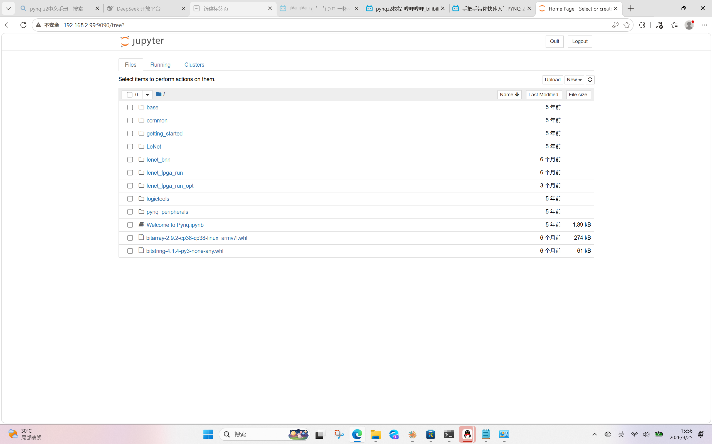

【任务】把刚到货的 PYNQ-Z2 用网线直连我的 Windows 笔记本，让浏览器能打开板子的 Jupyter；
并进一步验证断电重启后配置能自动恢复。

【提示词】
「[图：Windows IPv4 属性窗口] 以太网ip地址和掩码不显示怎么办」
「板子正常启动了。dns不能改成「自动获得 DNS 服务器地址」怎么回事」
（执行 set-pynq-ip.bat 后贴回的 ping 结果）「请求超时。来自 192.168.2.1 的回复: 无法访问目标主机。」
「我用check-board.bat试过了，成功了是不是」

【模型回答】
AI 没有凭记忆作答，而是逐层实测排查：
① 在我这台机器上跑 `ipconfig /all` 取实际值，判断 `169.254/16` 是 Windows 无 DHCP 时的兜底地址；
② 指导设静态 `192.168.2.1/24`，网关与 DNS 留空；
③ 交付 `set-pynq-ip.bat`（内容刻意全 ASCII，右键管理员运行，绕开中文网卡名的编码坑）；
④ 从 COM 口列表认出 FTDI 串口，用 PowerShell `System.IO.Ports.SerialPort` 直连板子控制台；
⑤ 在板内查出 `dhclient` 反复重配的冲突，把配置改成纯静态；
⑥ 最后软件关机 + 冷启动复验。

【哪里错了】

· **AI 的问题**
  1. ★ **AI 被我的描述带偏了。** 我说「DNS 改不动」，AI 就顺着这个字面去查 DNS。
     实际根因是**整个 IPv4 对话框的改动都没提交**（点「确定」时 UAC 提权框被漏点），
     与 DNS 毫无关系。—— **现象和根因完全无关，这个教训我记下了。**
  2. ★ **AI 自己写错了一条命令，把板子的网络配置搞坏了。**
     它执行了 `printf '...' | echo xilinx | sudo -S tee /etc/network/interfaces.d/eth0`，
     本意是把密码喂给 sudo。但 **`echo` 不转发 stdin**，于是把字面量 `xilinx`
     **直接写进了配置文件**，把一份好的配置覆盖成了一个单词。

· **环境的坑**
  3. 板子出厂配置是 `eth0 = dhcp` + `eth0:1 = static`，
     但 **`dhclient` 无限重试 DHCP，每次重配都把静态别名 `eth0:1` 冲掉**。
     现象很隐蔽：`ifconfig eth0` 里**只有 IPv6、没有 IPv4，却 `RX packets 832`** —— 收得到、回不了话。
  4. 板子的调试口是 **FTDI USB Serial**，而机器上同时存在 `COM3`/`COM4` 两个**蓝牙虚拟口**，容易认错。
  5. 跨境网络间歇性抽风：`git pull` 会偶发 `Connection was reset`，
     但同一时刻 `github.com` 的 curl 返回 200 —— **不是墙，重试即可**。

【怎么修正】
1. 改用命令行 `netsh interface ipv4 set address 7 static 192.168.2.1 255.255.255.0`
   （用网卡 `ifIndex = 7`，绕开中文网卡名的 GBK/UTF-8 编码坑）→ IP 生效。
2. 被写坏的配置，靠**下一步 `cat` 回读**才发现（预期 4 行，实际只有 `xilinx` 一行）。
   随即改用 `sudo -S bash -c 'echo ... > file ; ...'`
   （让密码和内容分处两地、不抢同一个 stdin），再 `cat` 核对 → 4 行全对。
   → **我由此定下一条铁律：凡是改配置的命令，下一条必须跟一条 `cat` 把内容读回来。**
3. 停掉 dhclient、写入纯静态配置后：主机 `ping` **0% 丢失 / 2ms**，
   `curl :9090` → **302**、`:80` → **301**，`pynq.local:9090` 亦可（mDNS 生效）。
4. **冷启动复验**：重新上电后板子 `uptime` 仅 2 分钟、`ifconfig eth0` 自动带上 `192.168.2.99`、
   `pgrep dhclient` 为空、主机 ping 0% 丢失
   → **「以后插上就能用」成为实证，而不是推测。**
5. 网络抽风按队友日志里记过的办法处理：`git config --global http.version HTTP/1.1`，必要时重试。

【沉淀】
→ `skill/pitfalls/pynq_direct_ethernet_windows.md`（5 个坑 + 验收清单 + 改配置铁律）
→ `skill/checkers/check_board_connection.bat`（一键自检脚本）

**证据截图**

> `log-004-board-jupyter.png` —— 2026-09-25 15:56,PYNQ-Z2 **冷启动后**,
> 浏览器访问 `http://192.168.2.99:9090/tree?`,Jupyter 正常列出板载文件系统
> (`base`、`getting_started`、`Welcome to Pynq.ipynb` 等)。