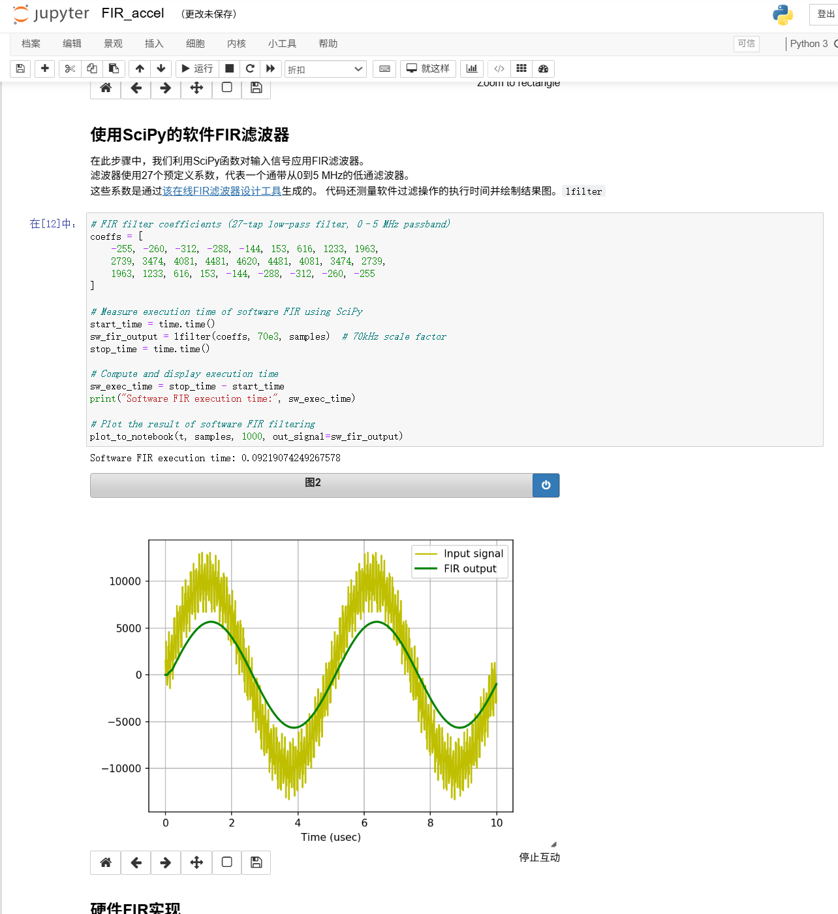
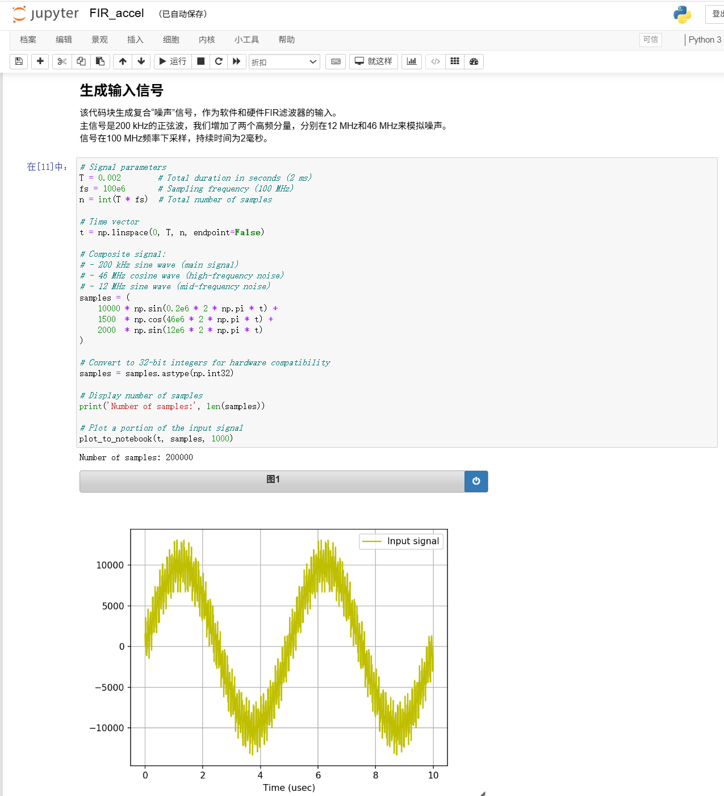
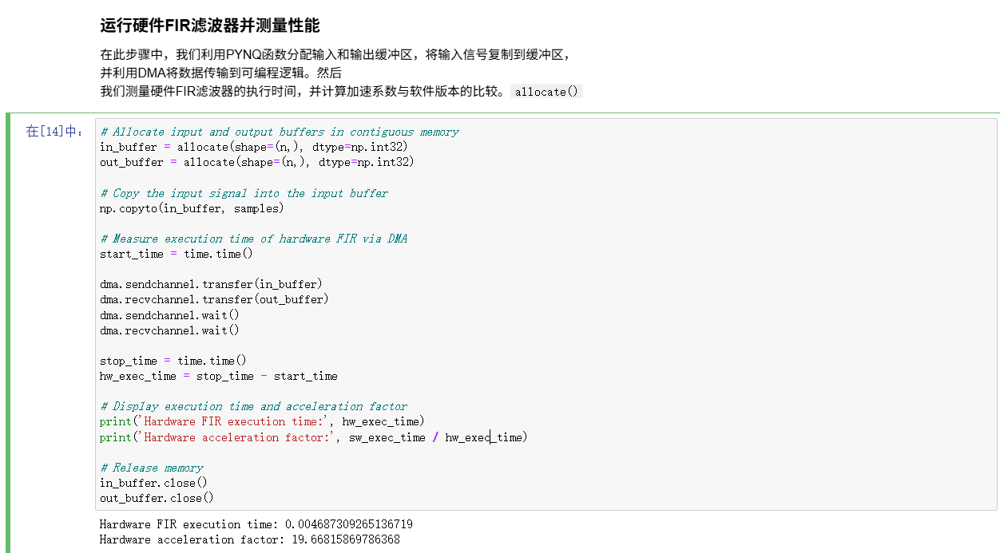
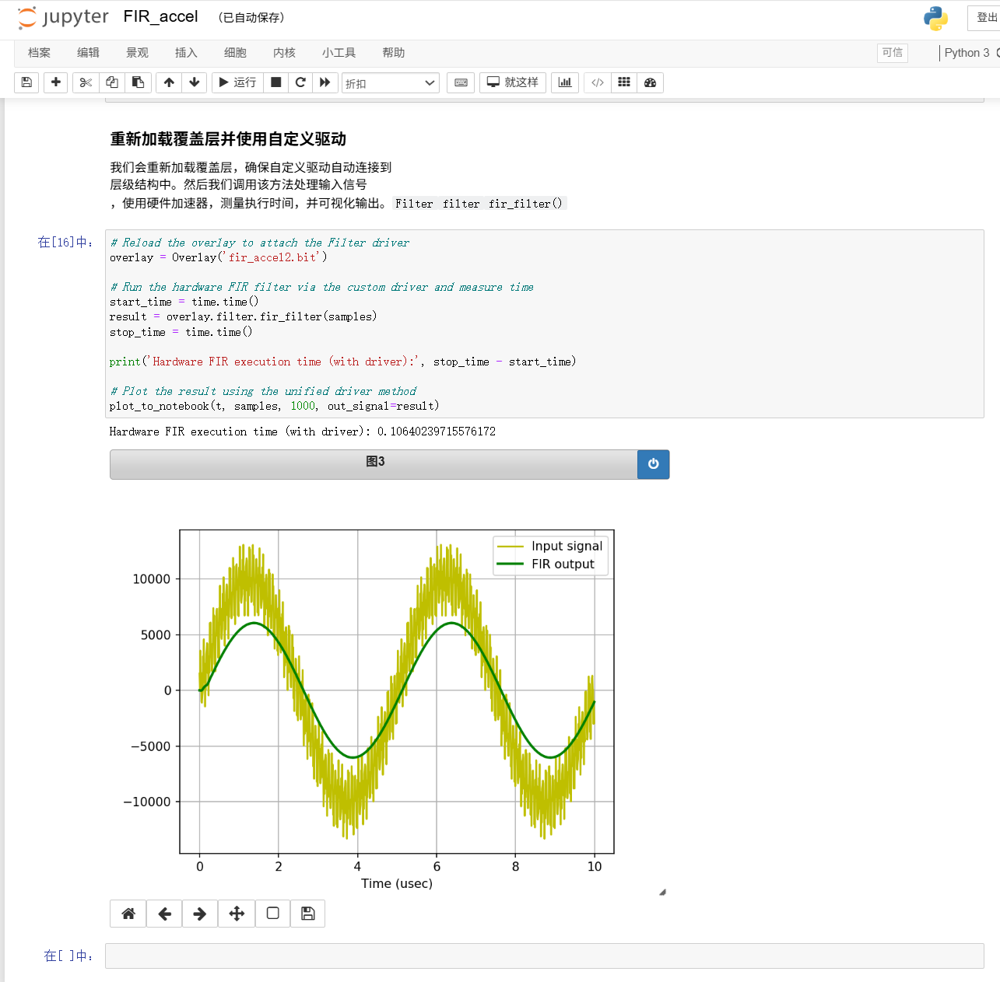

【任务】
我要把一份网上的参考项目（已经做好 FIR 硬件加速的 overlay）下载下来，在板子上加载并跑通。
目的是验证「用 Python 指挥 FPGA 做音频处理」这条路线

【提示词】
「推。现在板子连接成功了，vivado也能打开，帮我推送.bit,.hwh文件」
「结果没有显示出来是什么问题」

【模型回答】
AI 给我的主线是：不用 Jupyter 的网页 API（登录返回 403），改走 SSH/SFTP 把 `.bit` 和 `.hwh`
传上板子，再用板上 venv 里的 python 加载 overlay，最后做端到端验证。
但其中两个判断是它自己拍的，都错了；后面又撞上三个环境坑。

【哪里错了】

· **AI 的问题**
  1. AI 默认「板子上的 python 就是 `/usr/bin/python3`」，我没多想，照它给的命令跑
     → 直接报 `No module named 'pynq'`。
  2. AI 默认「Jupyter 可以用密码登录、调它的 API 传文件」→ 403，带上 xsrf 仍然 403，白试两轮。
     → 我记下的教训：**先看服务实际是怎么起的（`ps aux` / `systemctl`），别猜了再验。**

· **环境的坑**
  3. 板子上有两个 python，PYNQ 那个装在 venv 里、不在系统路径上；`/home/xilinx/pynq`
     只是指向它的软链。
  4. `Overlay()` 依赖环境变量 `XILINX_XRT`，而它只由 `/etc/profile.d/xrt_setup.sh`
     在**登录 shell** 里设置。SSH 直连跑命令属于非登录 shell，拿不到 → 报 `No Devices Found`。
     我加 `sudo` 也没用。
  5. 笔记本处于 **Not Trusted** 状态时，`%matplotlib notebook` 的图不会渲染，输出只剩一串 JS 对象。
     所以我「跑完了看不到结果」不是代码错，是笔记本没被信任。

【怎么修正】
1. 我换成 venv 的 python，并补上 `XILINX_XRT=/usr` → **overlay 一次加载成功**，
   连版本不匹配的告警都没触发。

2. 光「能加载」不算数，我又做了端到端验证：造 20 万点输入 → DMA 传输 **3.1 ms**
   → 拿硬件输出和软件参考做互相关，扫位移 −30..+30
   → 最佳位移 **+13**，正好等于 27 抽头 FIR 的群延迟 `(27−1)/2`
   → 该位移下相关系数 **1.000000** → **硬件结果与软件完全一致，只差一个固定延迟。**

3. 我在板载浏览器里跑参考 notebook 看性能：软件 **0.0922 s**，硬件 **0.00469 s** → **19.67 倍**。

4. 看不到结果的问题：File → Trust Notebook，然后重新运行。

【沉淀】
→ `skill/pitfalls/pynq_overlay_loading.md`（加载前置条件 + 互相关验板法）
→ 截图 `report/img/log-006 ~ log-009`

**证据截图**

> `log-006-ref-overlay-sw-fir.png` —— 2026-09-26 16:48，板载浏览器里跑参考项目第 4 格。
> 黄色是混了 200kHz + 46MHz + 12MHz 的输入信号，绿色是滤波后的输出（高频毛刺被削掉，
> 只剩干净的 200kHz）。软件耗时 0.0922 s。**滤波效果肉眼可见。**

> `log-007-ref-overlay-input-signal.png` —— 同上，第 3 格：输入信号 200kHz 主信号 +
> 12MHz / 46MHz 两个噪声，100 MHz 采样、20 万点。

> `log-008-ref-overlay-hw-accel.png` —— 同上，第 6 格：**硬件耗时 0.00469 s，加速倍数 19.67。**
> **FPGA 比软件快约 20 倍。**

> `log-009-ref-overlay-hw-driver.png` —— 同上，第 8 格，换成「带驱动」的写法后是 0.1064 s，
> **比第 6 格慢**。原因是这一版每次调用都重新申请内存，把申请的时间也算进去了。
