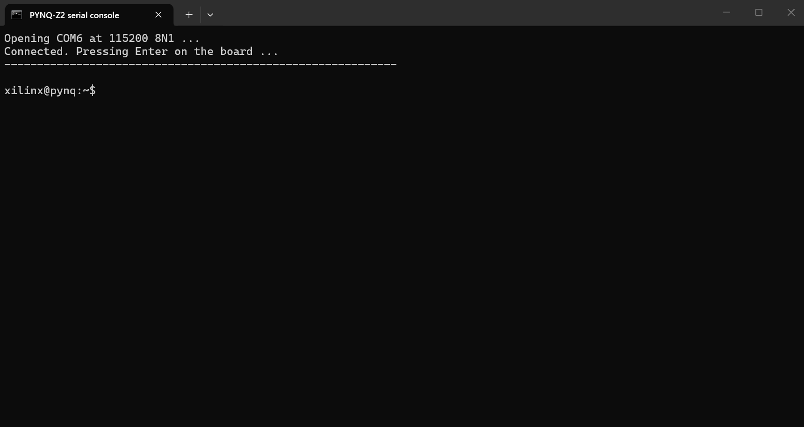

【任务】
把「不用网络也能进板子」这条路走通。
网络那条路已经通了，但串口是不依赖 IP、不依赖浏览器、不依赖 Jupyter 的备用通道 ——
板子网络出问题时它是唯一还能用的入口。

【提示词】
「把不用网络也能进板子这条路走通。」

【模型回答】
AI 原本的建议是装 PuTTY。改成了写一个双击就能用的脚本，不装任何软件：
用 Windows 自带的 PowerShell 加 `System.IO.Ports.SerialPort`，115200 8N1，
往板子写一个回车把登录提示符唤出来，再把回显打印出来。

【哪里错了】

· **AI 的问题**
  AI 在脚本里默认写了 `DtrEnable = $true` / `RtsEnable = $true`，
  并且准备把「必须置高 DTR/RTS」当成经验写进技能包。
  补了一次对照实测（不置高 DTR/RTS）—— **照样有输出**，这块板子上这个动作是多余的。
  → **没实测过的习惯写法，不能当经验传下去。**

· **环境的坑**
  设备管理器里同时有三个串口：`USB Serial Port (COM6)` 是板子，
  另外两个名叫「蓝牙链接上的标准串行」是蓝牙虚拟口。
  **认错 COM 号会连到蓝牙上去。**

【怎么修正】
1. 先查端口号再写死：确认板子那条是 `USB Serial Port (COM6)`。
2. 脚本先在无界面模式下自测一遍，确认能打出 `xilinx@pynq:~$`，才拿去用。
3. 跑通后截图存档。

【沉淀】
→ `skill/pitfalls/pynq_serial_console.md`（COM 口识别 + 连接参数 + 实测记录）
→ `skill/checkers/pynq_serial_console.ps1`（可直接运行的脚本）
→ 截图 `report/img/log-005-board-serial.png`

**证据截图**

> `log-005-board-serial.png` —— 2026-09-26 16:58，micro-USB 线直连板子的串口控制台，
> 窗口标题是脚本名，最后一行是 `xilinx@pynq:~$`。
> **这是「板子本身活着、能被直接控制」的证据** —— 不走网络、不开浏览器，
> 一根 USB 线就能进板子，和网络那条路是两条独立通道。
