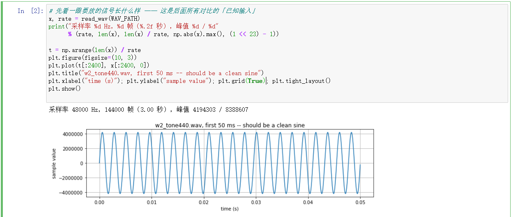
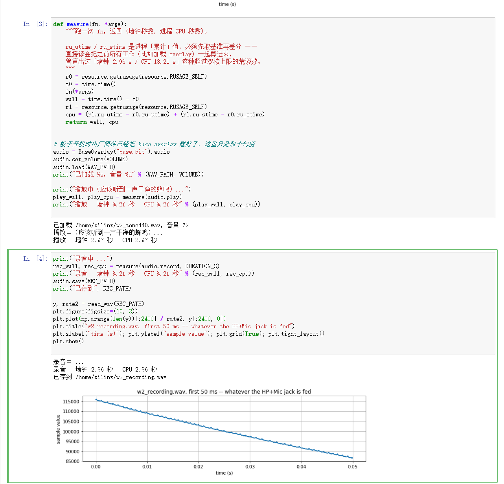

【任务】
让板子出声。这是整条路线里第一次让音频真正从板子的耳机口出来。

要的不是"跑通一个 API"，而是三件可复现的东西：

- 一段已知的音频进去，耳朵能听见
- 说清这段声音在板子上是**谁在搬**
- 脚本和波形图留在仓库里，别人照着能重跑

【提示词】
「读 PROGRESS.md 和 PLAN.md，继续这个项目」
（选今天的目标时选）「让板子出声（推荐）」

中途追问：
「fpga只起到搬运作用，不需要overlay？我对完整流程还是有疑问」

【模型回答】
板子开机时出厂固件已经把 base overlay 灌好了，所以不用自己建工程：
拿 `BaseOverlay('base.bit').audio` 得到音频对象，`set_volume()` 设音量，
`load()` 读 wav，`play()` 放。

AI 先拿手上那段 `recording_0.wav` 试，没听清；换自己生成的正弦波之后判定通路没问题。

关于"谁在搬"，AI 最初的回答是：**③号 FPGA 用硬件把这串数字搬过去。**

【哪里错了】

· **AI 的问题**
  「FPGA 用硬件把数字搬过去」这句话，AI 是**没验证就写出来的** —— 手边就有 `.hwh`
  可以查，但它是凭"FPGA 应该干这个"的印象写的。是我追问「这个过程不需要 overlay 吗」，
  才把它逼回去查。

  查完结论是反的：

  - `audio_codec_ctrl_0` 在 `.hwh` 里**只有一条 BUSINTERFACE**：`S_AXI`，类型 `SLAVE`。
    没有主接口，它自己不能去内存取数据。
  - 全设计 187 个 IP 里，`axi_dma_0` 只出现在 `trace_analyzer_pi` / `trace_analyzer_pmodb`
    下面 —— **音频通路里没有任何 DMA。**
  - 实测坐实：play / record 前后各取一次 CPU 时间做差分，播放 3 秒 = 墙钟 2.97 s、
    CPU 2.97 s；芯片双核，等于**一个核被 100% 占满**。

  → 结论：**搬运是 CPU 在扛，FPGA 只负责 I2S 时序和 codec 配置。**

· **AI 的问题（测量方法本身也错了一次）**
  第一次量 CPU 时间是直接读 `resource.getrusage(RUSAGE_SELF).ru_utime`，
  得到「墙钟 2.96 s / CPU 13.21 s」—— 双核不可能超过 2.96×2。
  原因是这个值**是进程累计值**，把之前加载 overlay 的时间一起算进来了。
  改成前后差分才是对的。

· **环境的坑**

  - 从串口控制台直接跑脚本报 `OSError: Root permissions required.`。
    同一份代码在 Jupyter 里能跑 —— 差别不在代码，在**谁在跑**：
    `/dev/mem` 属 `root:kmem`、`/dev/uio*` 是 `root` 专属，
    而 `xilinx` 用户在 `xilinx adm sudo` 组里、不在 kmem；
    Jupyter 服务本身是 root 起的。加 `sudo` 才能从命令行跑。
  - `set_volume()` 的上限是 **62**。报错信息写的是 "[0,63]"，但源码判断是
    `0 <= volume < 63` —— 照着报错信息写 63，直接 ValueError。
  - `Audio.load()` 只接受 **24 bit / 双声道 / 48 kHz** 的 wav（按每个采样 3 字节解包）。
  - 手上那段素材本身很安静（峰值只有满量程的 25%，底噪高），
    所以一开始"听不清"不是板子的问题。
  - 顺带查出两处写在项目文档里的信息是过期的（见【怎么修正】第 5 条）。

【怎么修正】
1. 加 `sudo` 从串口跑，并把"Jupyter 是 root 跑的"这条写进技能包，
   免得下次又当成代码写错了去排查。
2. 音量取 62（上限），素材不用原始录音 —— **自己生成一段数学上已知干净的正弦波**。
   放它还是干净的一声蜂鸣，就说明杂音来自素材而不是板子。
3. CPU 时间改成前后差分，两处独立证据定案：`.hwh` 看接口类型（静态）+ 实测 CPU（动态）。
4. 把整条流程落成两件可复现的东西：不带界面的脚本 + 带波形图的 notebook，
   两者用同一份代码，避免"截图里的代码和仓库里的对不上"。
5. 顺手核对出厂 overlay 里的实际内容，改掉两处过期描述：

   - 板子上跑的是 **Python 3.8**，不是文档里写的 3.6。
   - overlay 的 IP 清单里音频块叫 `audio_codec_ctrl_0`，
     没有另一个叫 `audio_direct` 的块。
   - 音频 IP 只有 `S_AXI` 从接口，所以"数据走 AXI-Stream 流过 FPGA"这种画法是错的，
     架构图要按实测重画。

【沉淀】
→ `board/scripts/verify_audio_playback.py`（命令行可跑，自检 + 计时）
→ `board/notebooks/w2_audio_playback.ipynb`（带两张波形图）
→ `skill/pitfalls/pynq_audio_playback.md`（四个卡点 + 两个 3.5mm 口的用法 + CPU 实测）
→ 截图 `report/img/log-010 ~ log-011`

**实测数据**（2026-09-27，出厂 base overlay，音量 62）：

| 动作 | 墙钟 | CPU | 说明 |
|---|---|---|---|
| 播放 3 秒 440 Hz 正弦波 | 2.97 s | 2.97 s | 听到干净蜂鸣 |
| 录音 3 秒 | 2.96 s | 2.96 s | 存回 wav 可分析 |

同一份代码的脚本版（`verify_audio_playback.py`）又独立跑了一遍：播放 2.96 / 2.96 s，
录音 2.95 / 2.95 s。两次差 0.01 s，属正常抖动，**结论一致：搬运占满一个核。**

顺带发现：录回来的信号**带直流偏置**（整体抬高约满量程的 1.2%）。
以后算频谱或做前后对比之前要先减均值，否则 0 Hz 处会冒一根假峰。

**证据截图**

> `log-010-board-audio-input-waveform.png` —— 2026-09-27 17:19，板载浏览器里跑
> `board/notebooks/w2_audio_playback.ipynb` 第 2 格。板子自己生成的 440 Hz 正弦波：
> 48000 Hz、144000 帧（3.00 秒）、峰值 4194303（满量程的一半），前 50 ms 是一根干净的正弦。
> **先有一段"已知干净"的输入，后面听到杂音才能判断是素材的问题还是板子的问题。**

> `log-011-board-audio-playback.png` —— 同上，第 3、4 格。`measure()` 用前后差分量播放和录音
> （注释里记着为什么必须差分）。播放 3 秒音频：**墙钟 2.97 s、CPU 2.97 s**；
> 录音 3 秒：**墙钟 2.96 s、CPU 2.96 s** —— CPU 时间贴着墙钟时间走，
> 这就是"搬运是 CPU 在做"的直接证据。下面是录回来的波形：整体被抬到 8.5 万 ~ 11.5 万之间
> （满量程 838 万），而且**缓慢往下漂**，不是一根压在 0 上的线。
